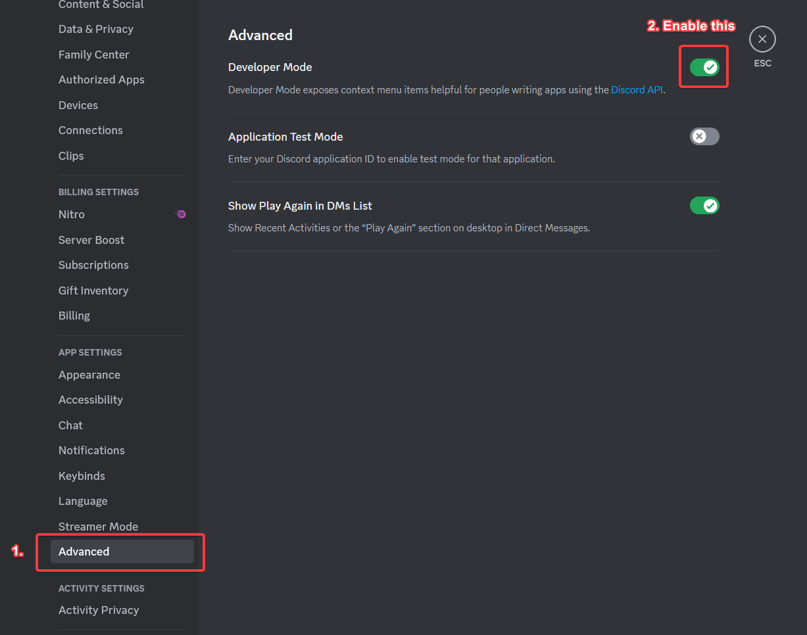
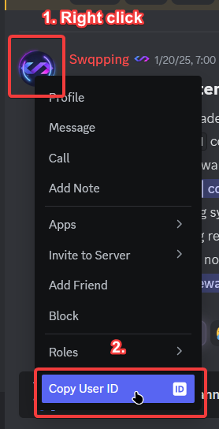

# How to get channel/role/user ID

### Step 1. Make sure you have Developer Mode enabled

Head over to your Discord settings, then Advanced, and then enable Developer Mode.

<figure><figcaption></figcaption></figure>

You can now close your settings and continue to the next step.

### Step 2. Grab the channel/role/user ID

After you have enabled Developer Mode, you should now see a new option when right clicking a user/channel/role. Just click on the "Copy User/Channel/Role ID" button, and the ID is pasted in your clipboard. You can now place the ID where it is asking.

<figure><figcaption></figcaption></figure>
