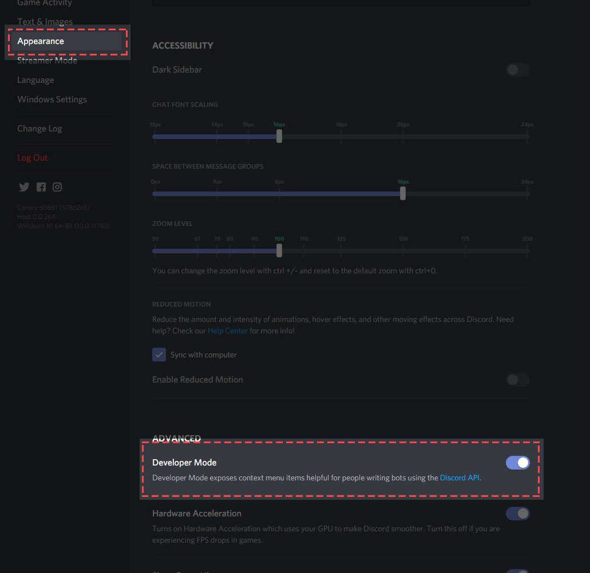

# How to get channel/role/user ID

## Make sure you have Developer Mode enabled

You'll find Developer Mode in User Settings > Appearance.

After you have enabled it, to get a user ID, Right click on a user and click "**Copy ID**", to get a channel ID, Right click on a channel and click "**Copy ID**", to get a role ID, Right click on a role and click "**Copy ID**"
