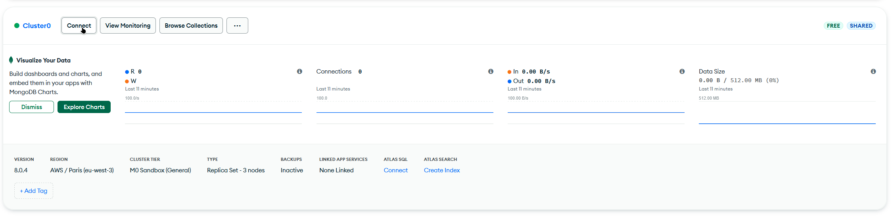

# Creating a MongoDB Cluster

To get the MongoDB connection string, you have to create a MongoDB Cluster. If you don't know how to do that, you can either watch this short tutorial video or follow the instructions below:

### Video tutorial:


[https://www.youtube.com/watch?v=Obg7\_TAZFMY](https://www.youtube.com/watch?v=Obg7_TAZFMY)


### Text:

This guide will guide you on how to create a MongoDB Cluster and generate a MongoDB connection string to put on your `config.yml` file.

We will do the following:

* Create a MongoDB Atlas Account
* Create a Cluster
* Make a user to connect to the cluster
* Allow our IP to connect to the cluster
* Insert the connection string to the `config.yml` file

### Step 1: Creating a MongoDB Atlas Account

To create a MongoDB Atlas account, go to [https://cloud.mongodb.com](https://cloud.mongodb.com), where you will be greeted with the landing page. Click on the "Try Free" button, then either sign up with Google, or sign up with email, then verify your email. You should now be on the Overview page.

### Step 2: Creating a MongoDB Cluster

To create a cluster, follow theses steps:

* Click on the big button that says "Create".
* At the top, click on the M0 template.
* Change the name, the provider, etc (or not)
* For the region, choose the region that is the closest to you.
* Disable "Preload sample dataset" on the quick setup section.
* Click on "Create Deployment" at the bottom.

After following all of theses steps, you should see that your MongoDB Cluster is currently building.

### Step 3: Make a user to connect

On the same page, locate the "Database Access" tab at the sidebar on the category called Security, and click on it.&#x20;

Then, click on the Add New Database User button. For the authentification method, keep it as Password. Setup your username and a password that you will remember (or generate), as this is needed for the bot to connect to the cluster.


**Never** share your MongoDB password to anyone, including staff, and keep the password at a safe place. Plex Development will never ask for your MongoDB password whatsoever.


Then, scroll down until you see the Database User Privileges, then go to the "Built-in role" dropdown. Click on "Add Built-in Role", and you should see 3 options when clicking on the "Select Role" dropdown. Click on the "Read and write to any database" role, and then finally click on the Add User button at the bottom.

### Step 4: Allowing our IP to connect

Locate the Network Access tab on the sidebar, and click on it. Click on "Add IP Address". Here, you should see 2 buttons at the top. If you want to allow access to the database from anywhere, choose the second button. Otherwise, if your bot is hosted somewhere else, input the IP Address of the server hosting the bot in the "Access List Entry" field. If you are hosting locally, you can click on the first button. Then, you can click the Confirm button.

### Step 5: Inserting the connection string to the `config.yml` file

For the product to be able to connect, you must get a connection string. To get one, go to the "Clusters" tab at the sidebar, and on your cluster, click on the connect button. It should look like this:

<figure><figcaption></figcaption></figure>

You should now see some options telling you ways to connect. Click on Drivers, then copy the string that starts with `mongodb+srv://` . A connection string usually looks like this:

```
mongodb+srv://<username>:<password>@<cluster-url>/<database>?retryWrites=true&w=majority
```

Now, go to the `config.yml` file of the product, and locate the `MongoURI` field. There, insert your connection string that MongoDB provided you. It usually looks like this:

```yaml
MongoURI: "mongodb+srv://<username>:<password>@<cluster-url>/<database>?retryWrites=true&w=majority>"
```


Congrats! You have successfully setup your MongoDB Cluster.

