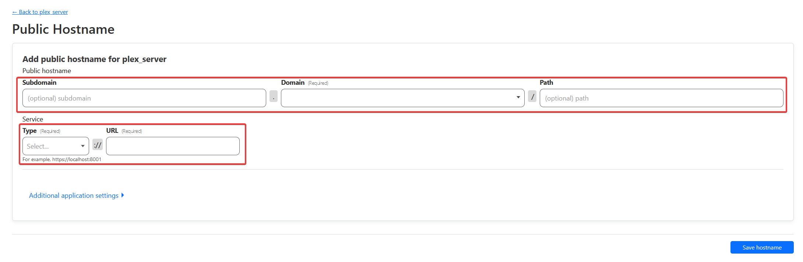

# Setting Up a Reverse Proxy with Cloudflare Tunnels

A reverse proxy allows you to use a custom domain for your self-hosted Node.js applications (like websites and bots with dashboards). This guide will walk you through setting up a reverse proxy using Cloudflare Tunnels, using Ubuntu as the base OS of this documentation. If you want a more advanced option, go [here](setting-up-a-reverse-proxy-with-cloudflare-tunnels.md).


This guide is only applicable if you're using a VPS, dedicated server, or similar. Shared hosting does not support custom reverse proxy setups.


### What is a Reverse Proxy?

A reverse proxy is a server that forwards requests from clients (e.g., web browsers) to another server. For example, when a user visits `https://yourdomain.com`, the reverse proxy directs the request to your application running locally (e.g., on `http://localhost:3000`). This is essential for:

* Using a custom domain with your application.
* Handling HTTPS (secure connections).
* Better performance and security management.

This guide assumes you already have:

1. An Ubuntu VPS or dedicated server.
2. A domain name that the DNS is managed by Cloudflare.
3. Your Node.js application running locally (e.g., on `http://localhost:3000`).

### Pros:

* Free of charge
* Full GUI, zero-config files
* You can put your application behind a firewall
* No need to expose your real IP
* No need a reverse proxy software such as Nginx, Caddy or Traefik
* Zero-config SSL
* Free SSL

### Cons:

* (Not a con if you are already using Cloudflare) Your domain's nameservers have to move to Cloudflare.

### Step 1. Creating a Tunnel

A tunnel is a reverse proxy where it goes to Cloudflare's servers and communicates with cloudflared, the daemon running on your server, which securely routes incoming traffic through the tunnel to the application. To create a tunnel, follow theses steps:

1. Login to Cloudflare, then go to the [Cloudflare Zero Trust](https://dash.teams.cloudflare.com/) page.
2. Go to `Network`, then `Tunnels`, then `Create a Tunnel`. A image is also placed below to show image steps.

<figure><figcaption></figcaption></figure>

3. Once you see 2 tunnel types, click on `Select Cloudflared`.

<figure><figcaption></figcaption></figure>

4. Name your tunnel name anything you want, like `plex_server`.
5. You should now be on a screen where you need to install and run the connector (cloudflared). Depending of your architecture and your operating OS, you must install cloudflared through the steps below that it provided you.
6. Once you have done the steps it provided you, you should now see your connector. Click on `Next`. The connector has successfully been installed.

### Step 2: Setting up a domain for our application

Now that we have the connector installed, we must make a domain where we can access the application.

Once you have successfully installed the connector, you should now be redirected to a page that looks similar like the image below. To fill theses missing fields, do theses:

* For the public hostname, put your favorite domain name. This will be used to access the dashboard. It must not be a already existing DNS record.
* Below, on the service field, for the type, select HTTP, and the URL must be `localhost:<port your application is using>`. For example, if the application is using the port 3000, you would put `localhost:3000`.
* Finally, click `Save Hostname`.

<figure><figcaption></figcaption></figure>

### Step 3: Making the application recognize our domain

Now that we have everything setup, we must now configure the application to accept proxies. Go to your `config.yml` file, and find `Secure`, and `trustProxy`. You must disable Secure and enable trustProxy instead. It should look like this:

```yaml
Secure: false # Enable if you are using HTTPS
trustProxy: true # Enable If your application is behind a reverse proxy (like Cloudflare, Nginx, etc.)
```

Make sure the URL and the callback URL matches the domain, and save the config, and restart the application.

### Adding multiple public hostnames

If you have multiple applications that are hosted on the same server, you can make a public hostname for each application. To do this, go back to `Network`, then `Tunnels`, then click on your tunnel, and click on the `Edit` button. Go to the `Public Hostname` tab, and then `Add a public hostname`. Then, repeat [Step 2](setting-up-a-reverse-proxy-with-cloudflare-tunnels.md#step-2-setting-up-a-domain-for-our-application) and [Step 3](setting-up-a-reverse-proxy-with-cloudflare-tunnels.md#step-3-making-the-application-recognize-our-domain).


Congratulations! Your setup is now complete. If everything is configured correctly, your application should be accessible via your custom domain. If you encounter any issues, double-check the steps above or contact support for assistance.

