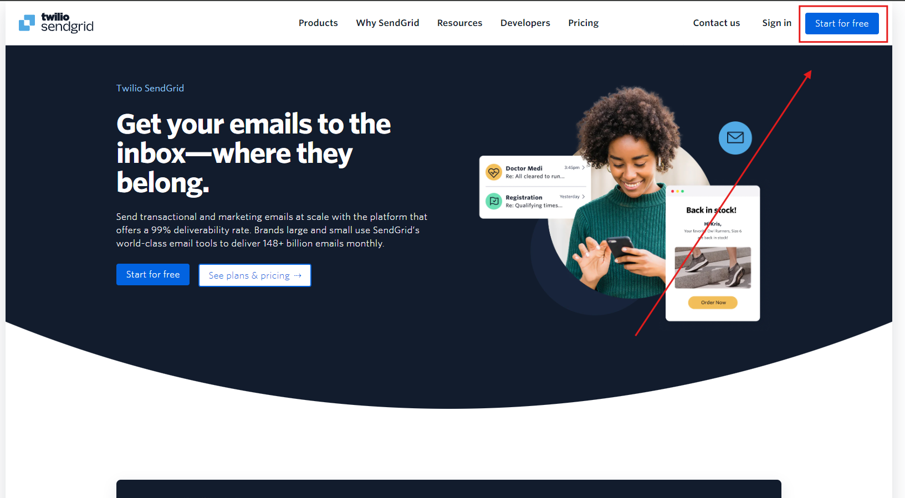
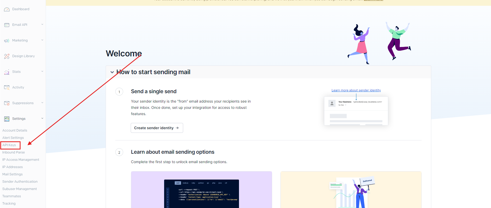
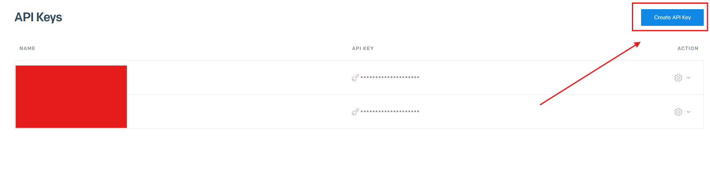
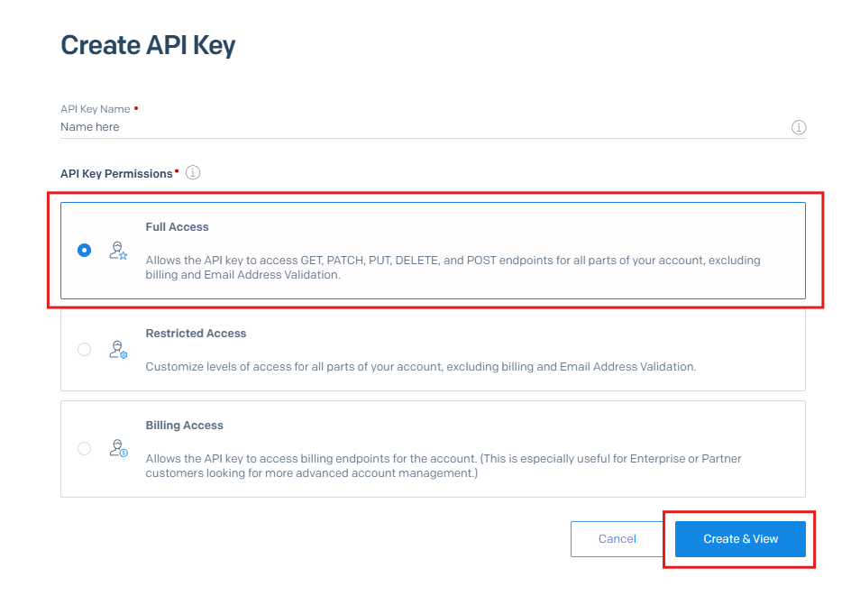

# Email System

**What is SendGrid?**

SendGrid is a service that helps you send emails from your apps or websites, like receipts, password resets, or newsletters. It’s free to get started and easy to set up—just create an account and use an API key to start sending emails quickly and securely.


**What is SMTP?**

SMTP stands for Simple Mail Transfer Protocol. It is a protocol used for sending email messages between servers. SMTP uses a process of routing emails from the sender's server to the recipient's server using a series of commands and responses to ensure the message's delivery. It's an essential component of the email system, providing a way for servers to communicate and exchange email data.

\
Plex Store uses emails for the following:

* When a customer purchases an item it sends them a confirmation email with a list of what they bought.
* General notifications


## Option 1: Using SendGGrid

### How to Get an API Key from SendGrid (Free)

### Step 1: Create a SendGrid Account

1. **Visit SendGrid**: Go to [SendGrid's website](https://sendgrid.com/).
2.  **Sign Up**: If you don’t have an account, click on the **Sign Up** button. Fill out the required information. (You will most likely need to add 2FA, or verify your phone number)

    _Image Description_: An image showing the SendGrid homepage with the **Sign Up** button highlighted.
3. **Choose a Free Plan**: During the sign-up process, choose the free plan.

<figure><figcaption></figcaption></figure>

### Step 2: Log In to Your SendGrid Account

1. **Log In**: After signing up, log in to your SendGrid account using your credentials.

### Step 3: Navigate to API Keys

1.  **Access the Dashboard**: Once logged in, you’ll be directed to the SendGrid dashboard.

    _Image Description_: The SendGrid dashboard, highlighting the left-side navigation panel.
2. **Go to API Keys**: On the left sidebar, click on **Settings** and then select **API Keys** from the dropdown menu.

<figure><figcaption></figcaption></figure>

### Step 4: Create an API Key

1. **Create a New API Key**: Click on the **Create API Key** button.
2. **Name Your API Key**: A prompt will appear asking you to name your API Key. Enter a descriptive name, such as “MyAppAPIKey”.
3. Click the **Create & View** button. Your API Key will be displayed. **Make sure to copy and store it securely**. You won’t be able to view it again.

<figure><figcaption></figcaption></figure>

<figure><figcaption></figcaption></figure>

### Step 5: Copy the API Key into Your `config.yml` File

1. Open the `config.yml` and paste the API Key wherever you need it.


## Option 2: Using SMTP

### How to get SMTP credentials (Free)

### Step 1: Creating an [SMTP2GO](https://www.smtp2go.com/) account

1. **Visit smtp2go:** Go to [SMTP2GO's website](https://www.smtp2go.com/)
2. Choose the free plan.
3. **Register**: Click on the Sign up button on the top right corner, and fill out the required information.

### Step 2: Log in to your account

1. If you not logged in yet, go to the main page of the website, and log in.

### Step 3: Connect your domain&#x20;

1. Go to Sending -> Verified senders and click on "Add sender domain".
2. Connect your domain based on the instructions.

### Step 4: Create an SMTP user

1. Go to Sending -> SMTP users and click on "Add SMPT user"
2. Fill out the required information, then click on the blue "Add SMTP User" button.

### Step 5: Fill out the config.yml

1. Open the config.yml of the store.
2. Go to the email settings.
3. Set **provider** to "smtp"
4. Set the SMTP details you got from smtp2go. Basic example:

```yaml
  smtp:
    host: "mail.smtp2go.com"
    port: 443
    secure: true
    user: "your-email@example.com"
    password: "your-smtp-password"
```
